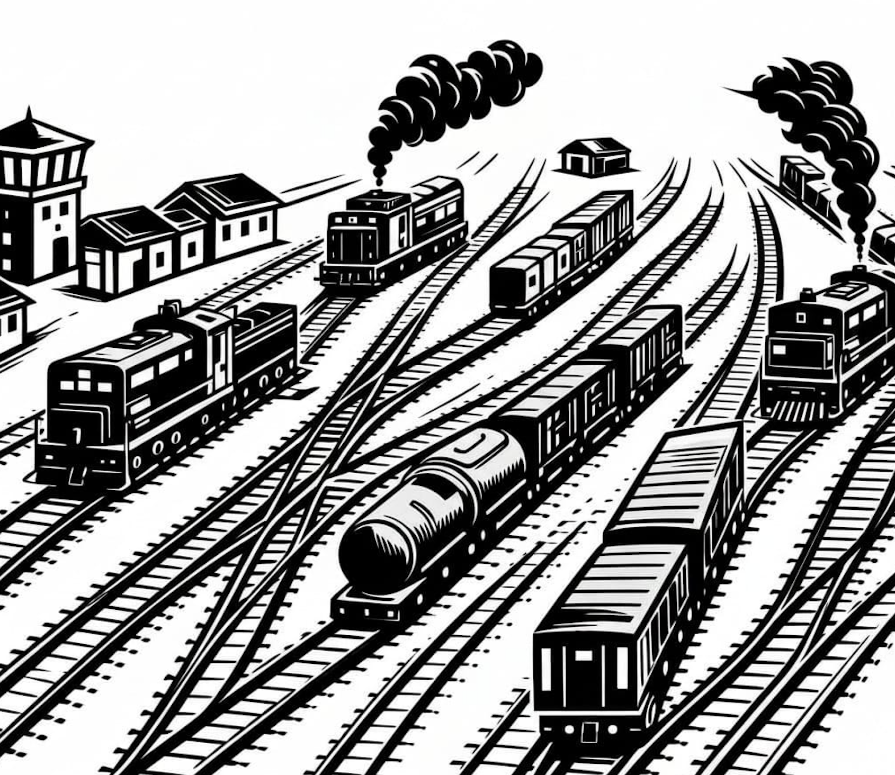

# All Together Now

<p align="center">
  
</p>

Multi-agent coordination server with shared wiki, event routing, and saga tracking.

Run a single ATN server on your Mac, compose local and remote agents at
runtime through a browser UI, and have them coordinate through shared
event queues and a wiki — with hard per-agent filesystem isolation on
remote hosts.

## Quickstart

```bash
cargo build --workspace
cargo run -p atn-server
```

Open http://localhost:7500. The dashboard renders an empty state — ATN
boots with zero agents. Click **+ New Agent** and fill in:

- `name` + `role`
- `transport`: `local`, `mosh`, or `ssh`
- `user` + `host` (for remote transports)
- `working_dir` on the target machine
- `agent`: which CLI to run (`claude`, `codex`, `opencode`, custom, ...)

ATN composes the shell command (a plain `cd DIR && AGENT` for local, or
`mosh USER@HOST -- tmux new-session -A -s atn-NAME 'cd DIR && AGENT'` for
remote) and spawns a PTY for that agent.

To see all three parts together, run the three-agent demo:

```bash
# Fake agent shims — no real CLIs or remote hosts required
./demos/three-agent/setup.sh

# Or with real claude/codex/opencode on queenbee
ATN_DEMO_REAL=1 ./demos/three-agent/setup.sh
```

See [docs/demo-three-agent.md](docs/demo-three-agent.md) for the full
walkthrough.

## Docs

- [docs/demos-scripts.md](docs/demos-scripts.md) — menu of runnable
  demos, grouped by duration + prereqs.
- [docs/uber-use-case.md](docs/uber-use-case.md) — the design: per-agent
  isolation via Unix users on remote hosts, coordinated through ATN.
- [docs/usage.md](docs/usage.md) — operational guide (empty-start,
  New Agent dialog, REST API, env vars).
- [docs/scale-ui.md](docs/scale-ui.md) — walkthrough of the treemap +
  filter + pin + keyboard flow at 21 agents.
- [docs/demo-three-agent.md](docs/demo-three-agent.md) — the concrete
  three-agent demo (coordinator/claude + two remote workers).
- [docs/remote-pty.md](docs/remote-pty.md) — manual integration test for
  real `mosh + tmux` sessions.
- [docs/architecture.md](docs/architecture.md) — crate layout.
- [docs/status.md](docs/status.md) — what's shipped.

## Screenshots

### Agents

4-panel TUI with live terminal sessions for each agent. Coordinator (Claude) is always first.


### Graph

Dependency graph showing coordinator hub connected to worker agents.


### Saga

Per-agent saga progress with step-by-step tracking. Coordinator column is always leftmost.


### Wiki

Shared wiki for inter-agent coordination. Agents read and write pages to exchange links, post requests, and log activity.


### Events

Two-column event log: outbound (Coordinator to Agents) on the left, inbound (Agents to Coordinator) on the right.


## Links

- Blog: [Software Wrighter Lab](https://software-wrighter-lab.github.io/)
- Discord: [Join the community](https://discord.com/invite/Ctzk5uHggZ)
- YouTube: [Software Wrighter](https://www.youtube.com/@SoftwareWrighter)

## Copyright

Copyright (c) 2026 Michael A. Wright

## License

MIT License. See [LICENSE](LICENSE) for the full text.
