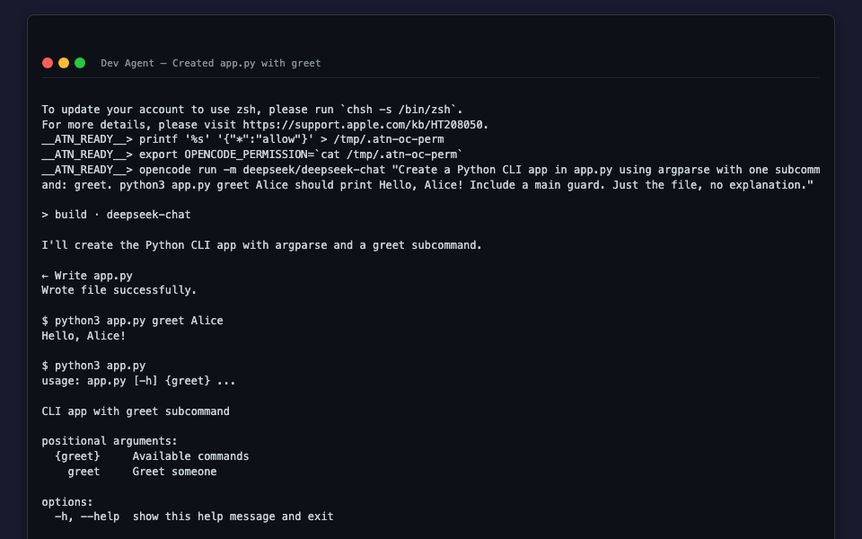
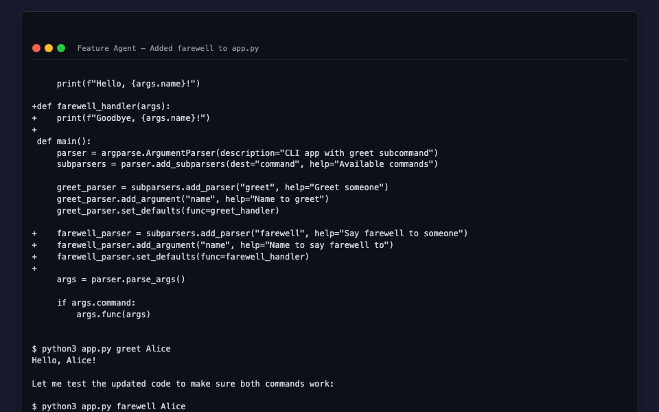

#+TITLE: ATN Multi-Agent Coordination Demo Review
#+DATE: 2026-03-30
#+DESCRIPTION: Two AI agents collaborate to build a Python CLI app, coordinated by ATN message routing

* Overview

Two AI agents build a Python CLI app together:
1. Agent *dev* creates ~app.py~ with a =greet= command
2. ATN routes a feature request to agent *feature*
3. Agent *feature* reads ~app.py~ and adds a =farewell= command
4. ATN routes a completion notice back to *dev*

- *Agents:* dev (Lead), feature (Developer)
- *AI Model:* deepseek/deepseek-chat via opencode
- *Duration:* ~55 seconds
- *AI Interactions:* 2 (create + edit)
- *Events Routed:* 2
- *Result:* PASS — both commands verified working

** Transcript sources

- ~demo/last-run/dot-atn/logs/dev/transcript.log~ — raw PTY output
- ~demo/last-run/dot-atn/logs/feature/transcript.log~ — raw PTY output
- ~demo/last-run/dot-atn/logs/*/inputs.jsonl~ — timestamped input commands
- ~demo/last-run/app-v1.py~ — app after step 1 (greet only)
- ~demo/last-run/app-v2.py~ — app after step 3 (greet + farewell)

* Architecture

#+begin_example
  +----------+     REST API     +------------+     PTY      +-----------+
  |  Demo    | ───────────────> | atn-server | ──────────>  | opencode  |
  |  Script  |  POST /input    | :7500      |  bash shell  | run -m    |
  |          |  POST /events    |            |              | deepseek  |
  +----------+                  +-----+------+              +-----------+
                                      |
                                .atn/ | outboxes → router (2s) → inboxes
                                      | logs/*/transcript.log
                                      | logs/*/inputs.jsonl
#+end_example

* Server Startup (23:20:38 UTC)

#+begin_example
All Together Now — PGM server starting
Spawned agent: dev (Dev (Lead))
Spawned agent: feature (Feature (Developer))
2 agent(s) running
Wiki storage initialized at .atn/wiki
Message router started (polling every 2s)
Listening on http://0.0.0.0:7500
#+end_example

* Step 1: Dev Creates App (23:20:42)

** Input

#+begin_example
23:20:42  opencode run -m deepseek/deepseek-chat "Create a Python CLI app
          in app.py using argparse with one subcommand: greet. python3
          app.py greet Alice should print Hello, Alice! Include a main
          guard. Just the file, no explanation."
#+end_example

** PTY Screenshot (dev)

#+CAPTION: Dev agent after creating app.py with greet command
#+ATTR_HTML: :width 100%

#+begin_export html

Interactive terminal (click to expand)

#+end_export
#+INCLUDE: "images/dev-final.html" export html
#+begin_export html

#+end_export

** Output: app.py v1 (greet only)

#+begin_src python
import argparse

def greet_handler(args):
    print(f"Hello, {args.name}!")

def main():
    parser = argparse.ArgumentParser(description="CLI app with greet subcommand")
    subparsers = parser.add_subparsers(dest="command", required=True)

    greet_parser = subparsers.add_parser("greet", help="Greet someone")
    greet_parser.add_argument("name", help="Name to greet")
    greet_parser.set_defaults(func=greet_handler)

    args = parser.parse_args()
    args.func(args)

if __name__ == "__main__":
    main()
#+end_src

** Verification

#+begin_example
23:20:57  python3 app.py greet World
          → Hello, World!
#+end_example

* Step 2: Route Feature Request (23:21:00)

** Event

#+begin_src json
{
  "id": "evt-add-farewell",
  "kind": "feature_request",
  "source_agent": "dev",
  "target_agent": "feature",
  "summary": "Add farewell subcommand to app.py",
  "priority": "high"
}
#+end_src

** Router

#+begin_example
23:21:00  Router: event evt-add-farewell from dev → Some("feature")
23:21:00  Router: delivered event evt-add-farewell to agent feature
#+end_example

The router writes to ~.atn/inboxes/feature/evt-add-farewell.json~ and injects
a notification into feature's PTY.

* Step 3: Feature Adds Farewell Command (23:21:03)

** Input

#+begin_example
23:21:03  opencode run -m deepseek/deepseek-chat "Read app.py. Add a second
          argparse subcommand called farewell so that python3 app.py farewell
          Alice prints Goodbye, Alice! Keep the existing greet command
          working. Update app.py in place."
#+end_example

** PTY Screenshot (feature)

#+CAPTION: Feature agent after adding farewell subcommand
#+ATTR_HTML: :width 100%

#+begin_export html

Interactive terminal (click to expand)

#+end_export
#+INCLUDE: "images/feature-final.html" export html
#+begin_export html

#+end_export

** Diff: app.py v1 → v2

#+begin_src diff
5a6,8
> def farewell_handler(args):
>     print(f"Goodbye, {args.name}!")
>
13a17,20
>     farewell_parser = subparsers.add_parser("farewell", help="Say farewell to someone")
>     farewell_parser.add_argument("name", help="Name to say farewell to")
>     farewell_parser.set_defaults(func=farewell_handler)
>
#+end_src

** Output: app.py v2 (greet + farewell)

#+begin_src python
import argparse

def greet_handler(args):
    print(f"Hello, {args.name}!")

def farewell_handler(args):
    print(f"Goodbye, {args.name}!")

def main():
    parser = argparse.ArgumentParser(description="CLI app with greet subcommand")
    subparsers = parser.add_subparsers(dest="command", required=True)

    greet_parser = subparsers.add_parser("greet", help="Greet someone")
    greet_parser.add_argument("name", help="Name to greet")
    greet_parser.set_defaults(func=greet_handler)

    farewell_parser = subparsers.add_parser("farewell", help="Say farewell to someone")
    farewell_parser.add_argument("name", help="Name to say farewell to")
    farewell_parser.set_defaults(func=farewell_handler)

    args = parser.parse_args()
    args.func(args)

if __name__ == "__main__":
    main()
#+end_src

** Verification

#+begin_example
23:21:29  python3 app.py greet World && python3 app.py farewell World
          → Hello, World!
          → Goodbye, World!
#+end_example

* Step 4: Route Completion Notice (23:21:32)

** Event

#+begin_src json
{
  "id": "evt-farewell-done",
  "kind": "completion_notice",
  "source_agent": "feature",
  "target_agent": "dev",
  "summary": "farewell subcommand added",
  "priority": "normal"
}
#+end_src

** Router

#+begin_example
23:21:32  Router: event evt-farewell-done from feature → Some("dev")
23:21:32  Router: delivered event evt-farewell-done to agent dev
#+end_example

* Timeline

| Time     | Event                                              |
|----------+----------------------------------------------------|
| 23:20:38 | Server starts, spawns dev + feature agents          |
| 23:20:42 | Dev: opencode creates app.py with greet             |
| 23:20:57 | Dev: greet tested (Hello, World!)                   |
| 23:21:00 | Router: delivers feature request to feature agent   |
| 23:21:03 | Feature: opencode reads app.py, adds farewell       |
| 23:21:29 | Feature: both commands tested (Hello + Goodbye)     |
| 23:21:32 | Router: delivers completion notice to dev            |
| 23:21:33 | Server: graceful shutdown (SIGTERM)                 |

Total: *55 seconds* from first AI interaction to shutdown.
API cost: ~$0.006 (2 deepseek-chat calls).

* Bugs Found

** ATN notification causes bash syntax error

The router notification ~[ATN] Message from dev: ... (priority: High)~ causes
~bash: syntax error near unexpected token '('~ because the parentheses are
unquoted.  The notification is injected as a coordinator command with a ~#~
prefix to make it a comment, but the ~(priority: High)~ portion falls on the
next line and is interpreted by bash.

* Reproducing

#+begin_src bash
# Run the demo (output to stdout)
bash demo/run-demo.sh

# Run with artifact capture
ATN_CAPTURE_DIR=demo/last-run bash demo/run-demo.sh

# Generate org dashboard from transcripts (for emacs auto-revert)
atn-replay dashboard .atn/logs -o .atn/dashboard.org

# Generate HTML terminal screenshots
atn-replay screenshot .atn/logs/dev/transcript.log \
  --html-fragment docs/images/dev-final.html \
  --title "Dev Agent"
#+end_src
